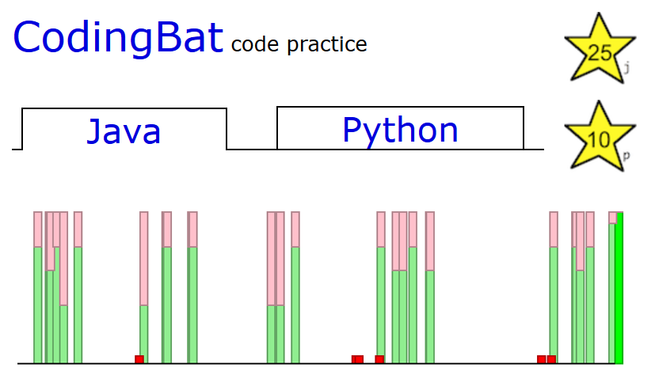
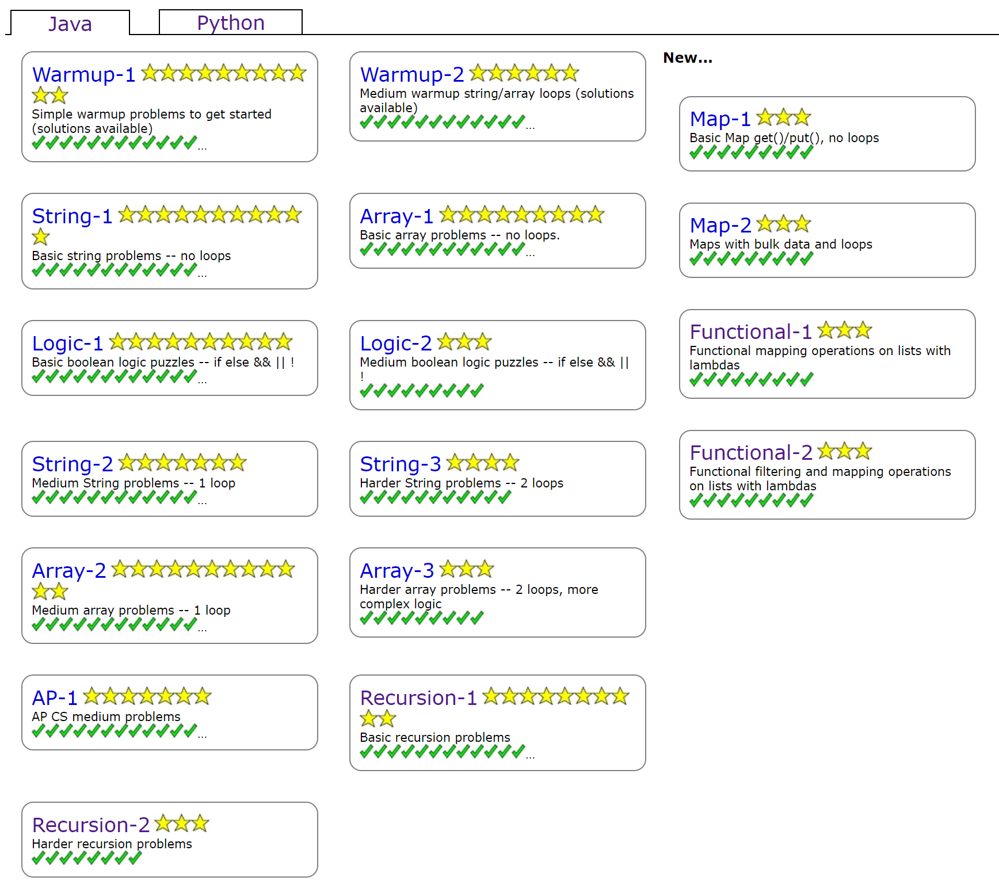
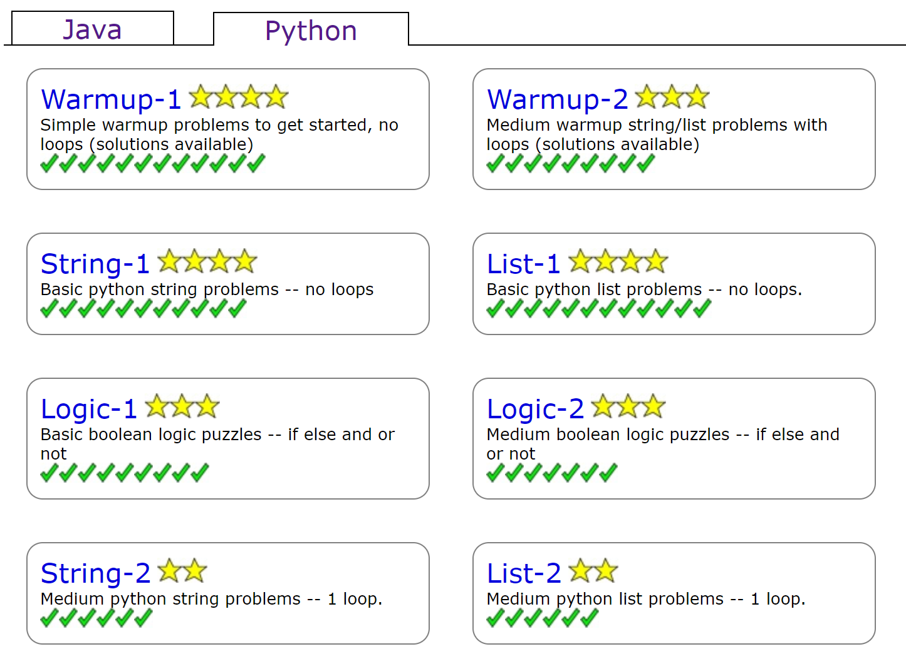

  

  <b>What is CodingBat?</b> 
  <a href="https://codingbat.com/about.html">CodingBat</a> is a site created by Stanford CS lecturer <a href="https://cs.stanford.edu/people/nick/">Nick Parlante</a> that provides programming exercises in Java and Python. Topics are limited to language/programming fundamentals (e.g., common control/data structures, built-in functions, & recursion), with a healthy range of difficulties. The focus is on quickly writing clean, efficient code for relatively small (though not always simple) functions.   
  <b>What's this repository for?</b> 
    A collection of my solutions to each of the exercises. Unfortunately, many existing public solutions are somewhat sloppy, overly complex, or otherwise difficult to read. Mine try to balance readability, efficiency, and general best practices.  

## [Java](https://codingbat.com/java)
    
| Section                                         | Solved/Total               |   | Section                                                 | Solved/Total                  |
|-------------------------------------------------|:--------------------------:|---|---------------------------------------------------------|:-----------------------------:|
| [Warmup-1](https://codingbat.com/java/Warmup-1) | [31/31](Java/Warmup1.java) |   | [Logic-1](https://codingbat.com/java/Logic-1)           | [30/30](Java/Logic1.java)     |
| [Warmup-2](https://codingbat.com/java/Warmup-2) | [17/17](Java/Warmup2.java) |   | [Logic-2](https://codingbat.com/java/Logic-2)           | [9/9](Java/Logic2.java)       |
| [Array-1](https://codingbat.com/java/Array-1)   | [27/27](Java/Array1.java)  |   | [Recursion-1](https://codingbat.com/java/Recursion-1)   | [30/30](Java/Recursion1.java) |
| [Array-2](https://codingbat.com/java/Array-2)   | [34/34](Java/Array2.java)  |   | [Recursion-2](https://codingbat.com/java/Recursion-2)   | [8/8](Java/Recursion2.java)   |
| [Array-3](https://codingbat.com/java/Array-3)   | [9/9](Java/Array3.java)    |   | [Map-1](https://codingbat.com/java/Map-1)               | [9/9](Java/Map1.java)         |
| [String-1](https://codingbat.com/java/String-1) | [33/33](Java/String1.java) |   | [Map-2](https://codingbat.com/java/Map-2)               | [9/9](Java/Map2.java)         |
| [String-2](https://codingbat.com/java/String-2) | [21/21](Java/String2.java) |   | [Functional-1](https://codingbat.com/java/Functional-1) | [9/9](Java/Functional1.java)  |
| [String-3](https://codingbat.com/java/String-3) | [11/11](Java/String3.java) |   | [Functional-2](https://codingbat.com/java/Functional-2) | [9/9](Java/Functional2.java)  |
| [AP-1](https://codingbat.com/java/AP-1)         | [21/21](Java/AP1.java)     |   |                                                         |                               |

## [Python](https://codingbat.com/python)

| Section                                           | Solved/Total               |   | Section                                           | Solved/Total               |
|---------------------------------------------------|:--------------------------:|---|---------------------------------------------------|:--------------------------:|
| [Warmup-1](https://codingbat.com/python/Warmup-1) | [12/12](Python/warmup1.py) |   | [String-1](https://codingbat.com/python/String-1) | [11/11](Python/string1.py) |
| [Warmup-2](https://codingbat.com/python/Warmup-2) | [9/9](Python/warmup2.py)   |   | [String-2](https://codingbat.com/python/String-2) | [6/6](Python/string2.py)   |
| [Logic-1](https://codingbat.com/python/Logic-1)   | [9/9](Python/logic1.py)    |   | [List-1](https://codingbat.com/python/List-1)     | [12/12](Python/list1.py)   |
| [Logic-2](https://codingbat.com/python/Logic-2)   | [7/7](Python/logic2.py)    |   | [List-2](https://codingbat.com/python/List-2)     | [6/6](Python/list2.py)     |

## Completion

Stars and checkmarks are CodingBat's way of displaying your progress through the exercises. As motivation for others working through the challenges, here's what it looks like when you've finished every problem:

### Completed - Java

  

### Completed - Python

  

